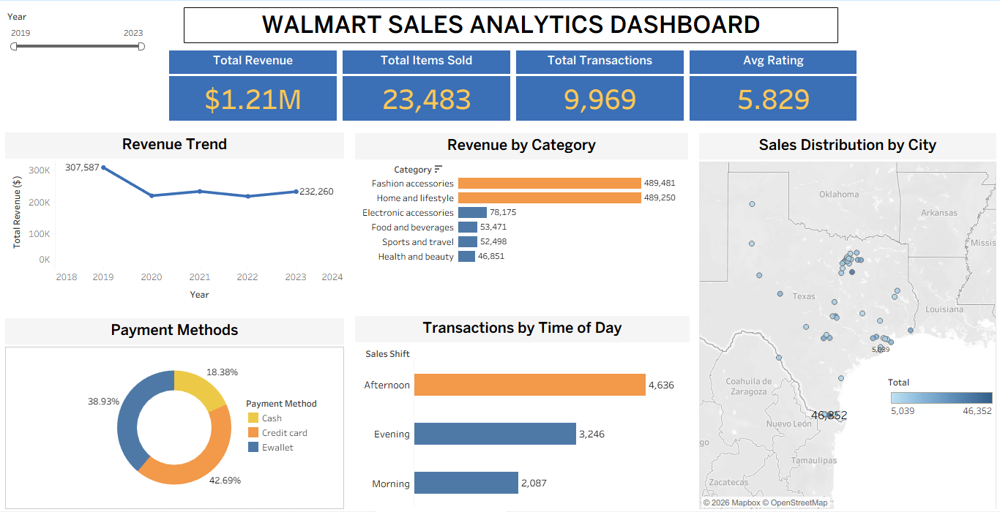

# Walmart Sales Analytics
### End-to-End Data Analytics Project | Python · MySQL · Tableau

---

## 1. Executive Summary

This project delivers an end-to-end retail analytics workflow using Python, MySQL, and Tableau.

Using 5 years of Walmart transactional data (9,969 records), I performed KPI-driven analysis to evaluate revenue trends, product category performance, customer behavior, and operational patterns.

The final output is an interactive Tableau dashboard designed to support data-driven retail decision making.

**Key Metrics:**

| Metric | Value |
|---|---|
| Total Revenue | $1.21M |
| Total Transactions | 9,969 |
| Total Items Sold | 23,483 |
| Avg Customer Rating | 5.83 |
| Time Period | 2019 – 2023 |

---

## 2. Business Problem

Retail businesses generate large volumes of transactional data that often goes underutilized. The objective of this project was to:

- Identify revenue trends and year-over-year growth patterns
- Evaluate category and branch-level profitability
- Understand customer payment preferences and satisfaction
- Surface operational insights around peak sales periods
- Deliver findings through an interactive business dashboard

---

## 3. Dataset Summary

| Attribute | Detail |
|---|---|
| Raw Records | 10,051 |
| Duplicate Rows Removed | 51 |
| Rows Removed (Missing Values) | 31 |
| Final Cleaned Dataset | 9,969 rows |
| Time Period | 2019 – 2023 |

**Original Features:** Invoice ID, Branch, City, Category, Unit Price, Quantity, Date, Time, Payment Method, Rating, Profit Margin

**Engineered Features:**
- `Total` = unit_price × quantity
- `Year` = extracted from date

---

## 4. Data Cleaning & Preparation (Python)

**Tools:** Pandas, NumPy, Matplotlib, Seaborn

**Duplicate Handling**
Identified and removed 51 duplicate records using `drop_duplicates()`.

**Missing Value Treatment**
Detected 31 null values in `unit_price` and `quantity`. Rows removed to ensure accurate revenue calculations.

**Data Type Standardization**
- Removed `$` symbol from `unit_price` and converted to float
- Converted `date` column to datetime
- Standardized all column names to lowercase

**Feature Engineering**
```python
df["total"] = df["unit_price"] * df["quantity"]
df["year"] = df["date"].dt.year
```
Cleaned dataset exported as `cleaned_walmart.csv` for downstream SQL analysis and Tableau dashboard integration.

---

## 5. Business Analysis with SQL

All business analysis conducted in **MySQL**. Key queries covered:

**Revenue Analysis**
- Total revenue and annual revenue trend (2019–2023)
- Revenue and profit breakdown by category
- Year-over-Year growth using `CTE` + `LAG()` window function

**Branch & Operational Analysis**
- Average profit margin per branch
- Busiest day per branch using `RANK()` window function
- Sales distribution by time of day (Morning / Afternoon / Evening)

**Customer Analysis**
- Transaction volume by payment method
- Highest-rated category per branch using `RANK()` window function

---

## 6. Key Business Insights

**Revenue Trend (2019–2023)**
Revenue peaked in 2019 at $307,587 before stabilizing around $210K–$232K annually. The trend suggests a post-2019 normalization worth investigating for strategic planning.

**Category Performance**
Fashion Accessories ($489,481) and Home & Lifestyle ($489,250) together account for ~81% of total revenue — significantly outperforming the remaining 4 categories. This signals a clear opportunity for inventory and marketing prioritization.

**Time-of-Day Sales Pattern**
Afternoon drives the highest transaction volume (4,636 transactions — 46.5% of all sales), followed by Evening (3,246) and Morning (2,087). This directly supports staffing and promotional scheduling decisions.

**Payment Method Distribution**
Ewallet (42.69%) is the dominant payment channel, followed by Credit Card (38.93%) and Cash (18.38%). The low cash usage suggests the customer base skews digital — relevant for checkout infrastructure decisions.

**Branch Profitability**
Average profit margin varies across branches, indicating differences in pricing strategy or product mix. High-margin branches can serve as benchmarks for operational improvements.

---
## 7. Skills Demonstrated

- Data Cleaning & Preprocessing (Pandas, NumPy)
- Feature Engineering
- Exploratory Data Analysis
- SQL Aggregations (SUM, AVG, COUNT, GROUP BY)
- Window Functions (RANK, LAG)
- CTE Usage for YoY Analysis
- Tableau Dashboard Design
- Business Insight Communication

---
## 8. Tableau Dashboard

<p align="center">
  
</p>

Built an interactive single-page dashboard featuring:

- **4 KPI Cards:** Total Revenue ($1.21M), Total Items Sold (23,483), Total Transactions (9,969), Avg Rating (5.83)
- **Revenue Trend Line Chart:** Annual revenue 2019–2023 with data labels
- **Revenue by Category Bar Chart:** Sorted by revenue with exact values
- **Sales Distribution Map:** Geographic bubble map of revenue by city across Texas
- **Payment Methods Donut Chart:** Percentage breakdown across 3 payment channels
- **Transactions by Time of Day:** Morning / Afternoon / Evening bar chart
- **Interactive Year Filter:** Slider filter to view any year's data in isolation

🔗 [View Live Dashboard on Tableau Public](https://public.tableau.com/app/profile/jhanvi.joshi6942/viz/walmart_sales_dashboard_17733265393420/walmart_sales_dashboard)


---

## 9. Strategic Recommendations

1. **Prioritize Fashion Accessories and Home & Lifestyle** in inventory planning — they drive 81% of revenue
2. **Schedule peak staffing during Afternoon hours** — 46.5% of all transactions occur then
3. **Invest in Ewallet infrastructure** — dominant payment channel at 42.7%
4. **Benchmark high-margin branches** to replicate successful operational practices across all locations
5. **Investigate the post-2019 revenue decline** — understanding the cause could unlock recovery strategies

---

## 10. Limitations

- No cost or inventory data available for true margin analysis
- Historical snapshot only — trends may not reflect current retail patterns

---

## 11. Next Steps

- Time-series forecasting for revenue prediction
- Customer segmentation using RFM analysis
- Integration of cost data for true profitability analysis
- Automated monthly reporting pipeline

---

